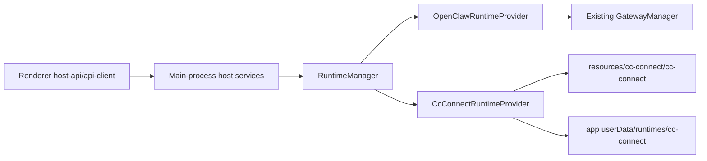

# ClawX Runtime Abstraction and cc-connect Proposal

## Proposal Status

Status: ready for engineering review

This proposal recommends introducing a runtime provider layer in the Electron main process, keeping OpenClaw as the default provider and adding cc-connect as an optional packaged provider. The first delivery should be treated as a capability-gated runtime platform foundation, not as full OpenClaw feature parity.

## Problem Statement

ClawX currently assumes OpenClaw Gateway is the only runtime. When OpenClaw runtime startup, diagnostics, or protocol behavior becomes unstable, ClawX has no clean fallback path. The renderer, host services, OpenClaw config paths, Doctor, Skills, sessions, channels, and cron surfaces are coupled to OpenClaw assumptions.

The product needs a runtime abstraction that lets ClawX switch between OpenClaw and cc-connect without rewriting renderer workflows or requiring users to install runtime dependencies manually.

## Recommendation

Implement `RuntimeManager` and provider-specific adapters in the Electron main process:

- `OpenClawRuntimeProvider` wraps the existing `GatewayManager`.
- `CcConnectRuntimeProvider` manages the cc-connect binary, config, working directory, logs, status, and supported commands.
- Renderer code continues using `src/lib/host-api.ts` and `src/lib/api-client.ts`.
- Legacy `gateway:*` IPC and event names remain as a compatibility layer during migration.
- OpenClaw remains the default runtime and rollback path.

## Decision Drivers

| Driver | Requirement |
|---|---|
| Stability | OpenClaw instability must not force a ClawX-wide renderer rewrite. |
| Rollback | Users and developers must be able to switch back to OpenClaw. |
| Offline packaging | Packaged ClawX must include cc-connect binaries and must not download them at app runtime. |
| Config isolation | ClawX must not mutate user `~/.cc-connect` state automatically. |
| Capability clarity | Unsupported runtime features must be visible and fail predictably. |
| Minimal churn | Existing chat, sessions, and Settings entry points should remain stable. |

## Scope

In scope:

- Runtime contract and manager.
- OpenClaw adapter wrapping current Gateway behavior.
- cc-connect adapter with managed config, packaged binary path resolution, process lifecycle, logs, status, and Doctor diagnose.
- Settings runtime selector and capability display.
- cc-connect build-time bundling scripts and Electron `extraResources`.
- Tests, docs, and communication regression validation.

Out of scope for the first delivery:

- Strict parity for OpenClaw Skills or ClawHub.
- OpenClaw internal config repair in cc-connect mode.
- Full provider/channel/cron parity if cc-connect does not expose equivalent interfaces.
- Removing `GatewayManager`.
- Runtime selection in renderer business logic.

## Current cc-connect Facts

- `cc-connect@1.3.2` is an npm package with a wrapper, install script, README, and downloaded release binary.
- The install script downloads release assets into `node_modules/cc-connect/bin/`.
- Packaged ClawX cannot depend on runtime postinstall or network access.
- The binary supports `doctor user-isolation`.
- `cc-connect@1.3.2` does not expose a `doctor fix` subcommand in local verification.

## Proposed Architecture



Runtime status extends the existing gateway status shape with:

- `runtimeKind`
- `capabilities`
- `configDir`

The provider contract covers:

- lifecycle: `start`, `stop`, `restart`, `status`, `health`
- messaging: `rpc`, `sendMessageWithMedia`
- sessions: `listSessions`, `loadHistory`, `deleteSession`
- diagnostics: `listLogs`, `runDoctor`
- feature discovery: `listCapabilities`

## Options Considered

| Option | Decision | Reason |
|---|---|---|
| Replace GatewayManager immediately | Rejected | Too much blast radius; weakens OpenClaw rollback. |
| Keep OpenClaw-only code and add cc-connect UI branch logic | Rejected | Pushes runtime concerns into renderer and duplicates behavior. |
| Add runtime manager in main process and wrap providers | Selected | Keeps renderer stable, centralizes lifecycle, and allows capability-aware fallback. |
| Declare `cc-connect` as runtime dependency only | Rejected | Does not satisfy offline packaged binary requirement. |
| Bundle verified cc-connect binaries through `extraResources` | Selected | Keeps binaries executable outside asar and supports offline app startup. |

## Packaging Proposal

`cc-connect@1.3.2` should be a locked `devDependency`. The packaged app should execute only the bundled resource binary:

```text
process.resourcesPath/cc-connect/cc-connect[.exe]
```

Build-time bundling should:

- read `cc-connect/package.json` for the locked version,
- download the target release asset,
- extract the binary to `build/cc-connect/<platform>-<arch>/`,
- chmod POSIX binaries,
- verify `--version` on the current host target,
- write `manifest.json` with version, source URL, platform, arch, and sha256.

Cross-target bundles can be downloaded and hashed locally, but they need platform CI to execute `--version`.

## Delivery Phases

| Phase | Purpose | Exit Evidence |
|---|---|---|
| Proposal | Align architecture, scope, non-goals, dependency policy, and rollout gates. | This document plus `docs/runtime-abstraction-cc-connect.md`. |
| Implementation | Add runtime manager, providers, packaging scripts, Settings UI, tests, and docs. | Local diff and mapped acceptance criteria. |
| Local verification | Validate typecheck, focused unit/E2E tests, comms regression, bundler current target, and docs sanity. | Commands recorded in delivery report. |
| Release readiness | Validate full package artifacts and cross-platform resources. | Platform package commands and CI artifacts. |
| PR/CI delivery | Commit, push, open PR, and observe CI. | PR URL, head SHA, terminal CI state or async follow-up. |

## Acceptance Criteria

| Acceptance | Evidence Needed |
|---|---|
| OpenClaw default and rollback preserved | Runtime default unit test; Settings switch; OpenClaw provider wrapper. |
| cc-connect selectable | Settings E2E and runtime status includes `runtimeKind`. |
| Managed cc-connect config | Provider unit test and path resolver under app userData. |
| OpenAI OAuth works in cc-connect mode | Provider profile unit test and E2E verify managed `CODEX_HOME/auth.json` plus Codex launch env. |
| cc-connect Doctor diagnose works | Unit test and command mapping to `doctor user-isolation --config <managed config>`. |
| Unsupported cc-connect capabilities degrade cleanly | Provider stable unsupported responses and capability-aware UI. |
| Packaged binary is offline-ready | `extraResources` config plus package artifact checks. |
| Communication paths remain stable | `pnpm run comms:replay` and `pnpm run comms:compare`. |

## Release Gates

Local implementation gates:

- focused unit tests pass,
- typecheck passes,
- Settings E2E passes,
- comms replay/compare passes,
- current-target cc-connect bundle verifies version,
- diff review and sensitive scan complete.

Release readiness gates:

- `pnpm run package:mac:local` verifies packaged resources on the developer platform,
- CI validates Windows/Linux cc-connect resources,
- current target app starts with OpenClaw default,
- cc-connect runtime can start from packaged resources or a mock binary in CI,
- PR remote CI reaches terminal success or has explicit async follow-up.

## Rollback Plan

- Switch runtime back to OpenClaw in Settings.
- Stop any cc-connect process owned by ClawX.
- Keep managed cc-connect config in app userData.
- Remove cc-connect bundling scripts/resources and devDependency only if the feature is fully reverted.

## Proposal Decision

Recommended decision: approve this as the first runtime abstraction increment for review and alpha validation, but do not mark it production-release-ready until the release readiness gates pass.
